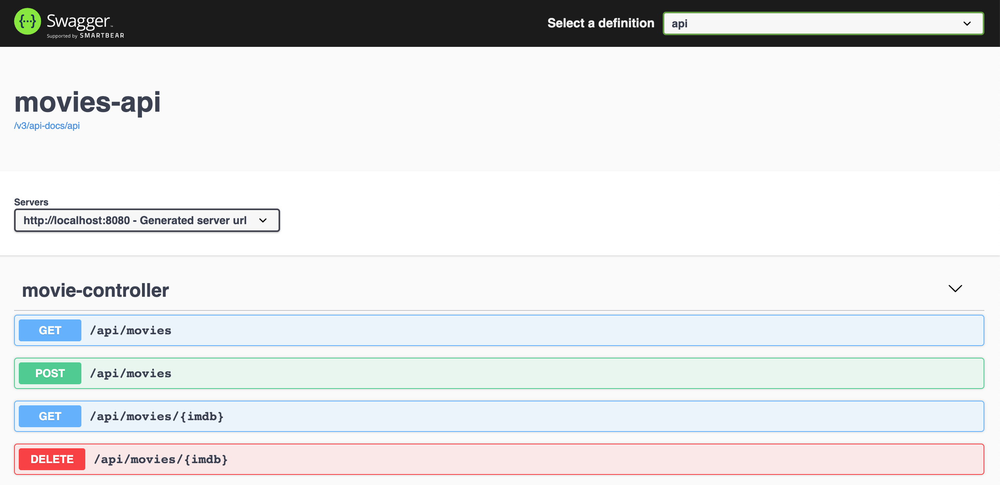
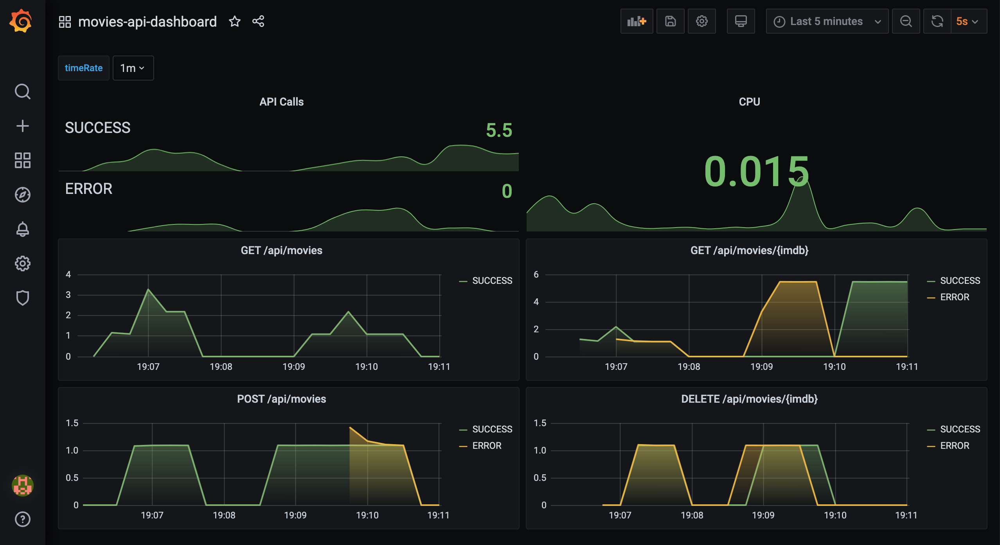
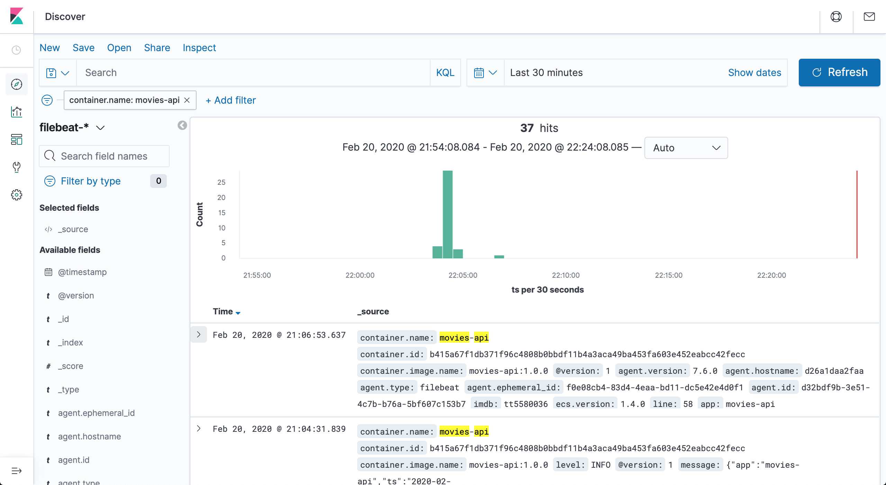

# springboot-elk-prometheus-grafana

The goal of this project is to implement a [`Spring Boot`](https://docs.spring.io/spring-boot/docs/current/reference/htmlsingle/) application, called `movies-api`, and use [`Filebeat`](https://www.elastic.co/beats/filebeat) & `ELK Stack` ([`Elasticsearch`](https://www.elastic.co/elasticsearch), [`Logstash`](https://www.elastic.co/logstash) and [`Kibana`](https://www.elastic.co/kibana)) to collect and visualize application's **logs** and [`Prometheus`](https://prometheus.io/) & [`Grafana`](https://grafana.com/) to monitor application's **metrics**.

## Application

- **movies-api**

  `Spring Boot` Web Java application that exposes a REST API for managing jobs. Its endpoints are displayed in the picture below

  

## Prerequisites

- [`Java 11+`](https://www.oracle.com/java/technologies/javase-jdk11-downloads.html)
- [`Docker`](https://www.docker.com/)
- [`Docker-Compose`](https://docs.docker.com/compose/install/)

## Start Environment

- Open a terminal and inside `springboot-elk-prometheus-grafana` root folder run
  ```
  docker-compose up -d
  ```

- Wait a little bit until containers be `Up (healthy)` (except `filebeat`). In order to check it run
  ```
  docker-compose ps
  ```

## Running application

### Development Mode

- Open a terminal and make sure you are inside `springboot-elk-prometheus-grafana` folder

- Run the following command
  ```
  ./mvnw clean spring-boot:run -DskipTests --projects movies-api
  ```
  > **Note:** If you want to change to "non-json-logs" (maybe during development it's useful), append to the comment above
  > ```
  > -Dspring-boot.run.jvmArguments="-Dspring.profiles.active=non-json-logs"
  > ```

### Docker in JVM Mode

- In a terminal, make sure you are inside `springboot-elk-prometheus-grafana` root folder

- Run the following command to build the image
  ```
  ./mvnw clean compile jib:dockerBuild --projects movies-api
  ```

- Finally, run the container
  ```
  docker run -d --rm --name movies-api \
    -p 8080:8080 -e MYSQL_HOST=mysql \
    --network=springboot-elk-prometheus-grafana_default \
    docker.mycompany.com/movies-api:1.0.0
  ```

### Application & Services URLs

- **movies-api**
  
  `movies-api` Swagger Website is http://localhost:8080/swagger-ui.html

- **Prometheus**

  `Prometheus` can be accessed at http://localhost:9090

  

- **Grafana**

  `Grafana` can be accessed at http://localhost:3000

  In order to login, type `admin` for both `username` and `password`

  

- **Kibana**

  `Kibana` can be accessed at http://localhost:5601

  _Configuration_

  - Access `Kibana` website
  - Click on `Explore on our own`
  - On the icons present on the left, click on `Discover`
  - Type `filebeat-*` in the `Index pattern` text-field and click on `> Next Step` button
  - In the `Time Filter field name` combo-box, select `ts` and click on `Create index pattern` button
  - Click again on the `Discover` icon (present on the left)
  - In order to just see `movies-api` logs, add a filter that contains
    - Field: `container-name`
    - Operator: `is`
    - Value: `movies-api`
  
  

- **Elasticsearch**

  `Elasticsearch` URL is http://localhost:9200

  _Useful queries_
  ```
  # Check ES is up and running
  curl localhost:9200
  
  # Check indexes in ES
  curl "localhost:9200/_cat/indices?v"
  
  # Check filebeat index mapping
  curl "localhost:9200/filebeat-*/_mapping"
  
  # Simple search
  curl "localhost:9200/filebeat-*/_search?pretty"
  ```

## Shutdown

- Stop application

  - If the application was started with Maven, go to the terminals where it is running and press `Ctrl+C`
  - If the application was started as a Docker container, run the command below
    ```
    docker stop movies-api
    ```

- To stop and remove `docker-compose` containers, networks and volumes, make sure you are in `springboot-elk-prometheus-grafana` root folder and run
  ```
  docker-compose down -v
  ```

## Reference

- http://development.wombatsecurity.com/development/2018/12/20/json-logging-for-spring-boot/
- https://medium.com/@sece.cosmin/docker-logs-with-elastic-stack-elk-filebeat-50e2b20a27c6