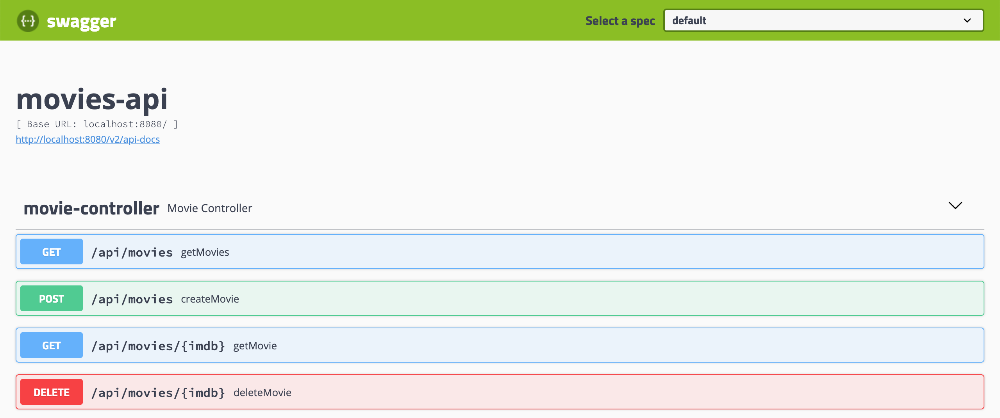

# `springboot-elk-prometheus-grafana`

The goal of this project is to implement a [`Spring Boot`](https://docs.spring.io/spring-boot/docs/current/reference/htmlsingle/) application, called `movies-api`, and use [`Filebeat`](https://www.elastic.co/beats/filebeat) & `ELK Stack` ([`Elasticsearch`](https://www.elastic.co/elasticsearch), [`Logstash`](https://www.elastic.co/logstash) and [`Kibana`](https://www.elastic.co/kibana)) to collect and visualize application's **logs** and [`Prometheus`](https://prometheus.io/) & [`Grafana`](https://grafana.com/) to monitor application's **metrics**.

## Application

### movies-api

`Spring Boot` Web Java application that exposes a REST API for managing jobs. Its endpoints are displayed in the picture below



## Start Environment

Open a terminal and inside `springboot-elk-prometheus-grafana` root folder run
```
docker-compose up -d
```

Wait a little bit until containers be `Up (healthy)` (except `filebeat`). In order to check it run
```
docker-compose ps
```

## Running application

### Development Mode

Open a terminal and inside `springboot-elk-prometheus-grafana` folder run
```
./mvnw clean spring-boot:run -DskipTests --projects movies-api
```

### Docker in JVM Mode

Before building the docker image, you need to package the application `jar` file. So, in a terminal and inside `springboot-elk-prometheus-grafana` folder run
```
./mvnw clean package -DskipTests
```

Then, build the image
```
./mvnw clean spring-boot:build-image -DskipTests
```

Finally, run the container using
```
docker run -d --rm --name movies-api -p 8080:8080 \
 --network=springboot-elk-prometheus-grafana_default -e MYSQL_HOST=mysql \
 movies-api:1.0.0
```

### Application URL

`movies-api` swagger website is http://localhost:8080

## Services URLs

### Prometheus

`Prometheus` can be accessed at http://localhost:9090


### Grafana

`Grafana` can be accessed at http://localhost:3000

In order to login, type `admin` for both `username` and `password`


### Kibana

`Kibana` can be accessed at http://localhost:5601

#### Configuration

- Access `Kibana` website
- Click on `Explore on our own`
- On the icons present on the left, click on `Discover`
- Type `filebeat-*` in the `Index pattern` text-field and click on `> Next Step` button
- In the `Time Filter field name` combo-box, select `ts` and click on `Create index pattern` button
- Click again on the `Discover` icon (present on the left)
- In order to just see `movies-api` logs, add a filter that contains
  - Field: `container-name`
  - Operator: `is`
  - Value: `movies-api`
  


### Elasticsearch

`Elasticsearch` URL is http://localhost:9200

**Useful queries**
```
# Check ES is up and running
curl http://localhost:9200

# Check indexes in ES
curl http://localhost:9200/_cat/indices?v

# Check filebeat index mapping
curl http://localhost:9200/filebeat\*/_mapping

# Simple search
curl http://localhost:9200/filebeat\*/_search
```

## Cleaning up

Run the command below to stop `movies-api`
```
docker stop movies-api
```

To stop and remove `docker-compose` containers, networks and volumes, run
```
docker-compose down -v
```

## Reference

- http://development.wombatsecurity.com/development/2018/12/20/json-logging-for-spring-boot/
- https://medium.com/@sece.cosmin/docker-logs-with-elastic-stack-elk-filebeat-50e2b20a27c6